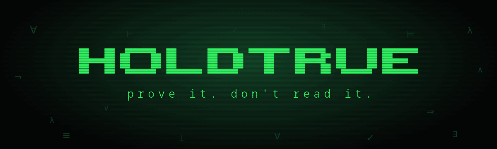
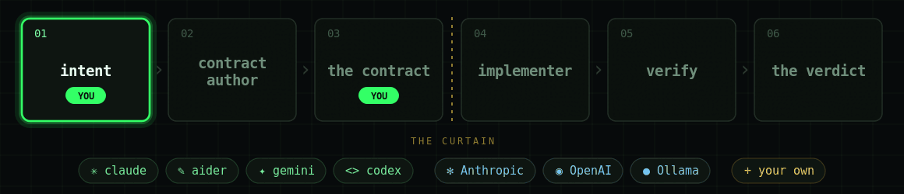

[](https://github.com/holdtrue-dev/holdtrue/actions/workflows/ci.yml)


**prove it. don't read it.**

AI writes the code. **You** approve a contract. `holdtrue` proves it holds.

Site: https://holdtrue-dev.github.io

## how it works

`holdtrue` splits one job across two AI contexts that never meet, with you in the middle. You say what you want. The first context turns that into a contract you read and approve. The second, behind a curtain, writes code from the contract alone. `holdtrue` then checks the code against the contract and hands you a verdict with the evidence to back it.

1. **the intent**: you say what the code should do, in plain language.
2. **contract author**: AI drafts a machine-checkable contract from your intent.
3. **the contract**: you read it and approve. This, not the code, is what you sign off on.
4. **the curtain**: the implementer never sees your intent, the held-out tests, or the reference oracle. Only the contract crosses.
5. **implementer**: AI writes the code from the contract alone.
6. **verify**: `holdtrue` checks it in a sandbox with types, proof, properties, a negative-probe, and mutation.
7. **the verdict**: `holdtrue` gives the final call, always with the evidence.



Both contexts run on whatever assistant you choose: a coding-agent CLI ([`claude`](https://github.com/anthropics/claude-code), [`aider`](https://github.com/Aider-AI/aider), [`gemini`](https://github.com/google-gemini/gemini-cli), [`codex`](https://github.com/openai/codex)), a chat API ([Anthropic](https://www.anthropic.com), [OpenAI](https://openai.com), [Ollama](https://ollama.com)), or your own command through `HOLDTRUE_AGENT_CMD`. Run `holdtrue providers` to see what is usable and pick one with `--provider`. The assistant and the model do not change the result. The proof is the same either way.

## the intent

Everything starts with a sentence. Here is the entire intent for the `clamp` example:

> #### intent: clamp
>
> Clamp a number into a range. Given `x`, `lo`, `hi`, return `x` if it sits inside `[lo, hi]`, otherwise return the nearest bound.

That is all you write. Everything after it is proof.

## the contract

The author turns that sentence into something a machine can check. You read it once, in plain words, before anyone writes code:

```python
@deal.pre(lambda x, lo, hi: lo <= hi)
@deal.ensure(lambda x, lo, hi, result: lo <= result <= hi)
@deal.ensure(lambda x, lo, hi, result: result == min(max(x, lo), hi))
@deal.raises()
def clamp(x: int, lo: int, hi: int) -> int: ...
```

- **precondition** (`@deal.pre`): the promise holds only for a valid range.
- **in range** (`@deal.ensure`): the result lands inside `[lo, hi]`.
- **exact value** (`@deal.ensure`): it equals the clamped number, not just something in range.
- **no surprises** (`@deal.raises()`): it raises nothing.
- **signature**: the name and types the implementer has to match.

This is what you review and approve. Not the code.

## the verdict

`holdtrue` never answers without evidence. Every intent comes back as exactly one verdict:

- 🟢 `GUARANTEED`: proven over every input, and the contract is strong enough to catch injected bugs and reject broken stand-ins.
- 🔵 `ENFORCED`: checked at runtime on every call and clean over every sampled input, but not proven for all of them. This is the honest tier for shapes a prover cannot exhaust, like strings, lists, floats, and loops. A violating input raises instead of slipping through.
- 🟡 `UNGUARANTEED`: only sampled evidence so far, so it still needs your eyes.
- 🔴 `FAILED`: a concrete counterexample, with the exact input that breaks it.

## features

- **sealed contexts.** The author and the implementer share no memory. The curtain is the filesystem, not a promise: the implementer's workspace holds the contract and nothing else.
- **you approve the contract, not the diff.** What you sign off on is a short, checkable spec, not a wall of code.
- **a real proof tier.** For pure integer code, CrossHair walks every path and proves the contract for all inputs, not a sample.
- **an honest fallback.** Rich types cannot be proven, so they are enforced at runtime and differential-tested against a held-out oracle, then reported as 🔵 `ENFORCED`. Never dressed up as proof.
- **a non-vacuous check.** A negative-probe confirms the contract actually rejects broken implementations, so a pass means something.
- **type and mutation gates.** `mypy --strict` guards the types; cosmic-ray mutates the code to check the tests would notice a bug.
- **many functions, one contract.** A contract can pin several functions at once, each verified on its own, with a per-function verdict and an overall result only as strong as its weakest part.
- **never-silent revision.** When a contract fails its own self-check, `holdtrue` proposes a fix, refuses any change that weakens a check, waits for your approval, and records every change.
- **any assistant.** Coding-agent CLIs or chat APIs, local or hosted, behind one `--provider` flag.
- **sandboxed and reported.** Every check runs inside a bubblewrap sandbox on Linux, and holdtrue refuses to run AI-written code unsandboxed unless you pass `--no-sandbox`. Each run writes a JSON and Markdown report: the verdict, the deciding check, and what was and was not tested.

## getting started

You need Python 3.12, [uv](https://docs.astral.sh/uv), and, for the sandbox, [bubblewrap](https://github.com/containers/bubblewrap) (Linux only). Without bwrap, pass `--no-sandbox` to run the checks directly on your machine.

Clone it, sync, and run your first verification:

```bash
git clone https://github.com/holdtrue-dev/holdtrue
cd holdtrue && uv sync
source .venv/bin/activate

holdtrue verify examples/clamp --impl examples/clamp/controls/correct.py
```

That prints 🟢 `GUARANTEED` with its evidence. Swap in `controls/buggy.py` to watch it come back 🔴 `FAILED` with the input that breaks it, or add `--manifest contract/manifest_weak.yaml` to see a correct function refused a guarantee because the contract itself is too weak.

## see it run

You can also watch it run, from a single check to the full loop:

```bash
# stream one verification live
holdtrue tui examples/clamp --impl examples/clamp/controls/correct.py

# drive the full loop in a TUI: pick a provider, type an intent,
# approve the contract, watch it run to a verdict
holdtrue studio

# run the same loop from the command line
holdtrue run examples/clamp --yes
```

## holdtrue make

`holdtrue make` takes an intent and drives the whole pipeline from a blank directory to a verdict.

```bash
holdtrue make "sort a list of integers"
holdtrue make @intent.md --no-review     # skip the contract approval prompt
holdtrue make "clamp(x, lo, hi)" --studio  # open the TUI instead
```

The project directory is named from the first four words of the intent and written to the current directory. Pass `--out <dir>` to choose a different location.

**files written to the project:**

| file | written by | what it is |
| --- | --- | --- |
| `intent/intent.md` | scaffold | the intent you passed in |
| `conftest.py` | scaffold | lets `pytest .` run against the reference oracle |
| `contract/manifest.yaml` | author | the machine-checkable contract |
| `contract/tests_shown/test_<name>.py` | author | Hypothesis property tests the implementer may see |
| `contract_private/reference_impl.py` | author | the private reference oracle |
| `contract_private/tests_heldout/test_<name>_heldout.py` | author | held-out differential tests comparing the implementation against the oracle |
| `reports/evidence_report.md` | verify | human-readable verdict with evidence |
| `reports/evidence_report.json` | verify | same report, machine-readable |

Two files appear only if the contract needed revision during the run:

| file | what it is |
| --- | --- |
| `revisions/CHANGELOG.md` | every proposed contract change, with its reason |
| `revisions/revisions.jsonl` | same log, machine-readable |

The generated implementation (`src/core.py`) lives only in a temp workspace during the run and is not saved back to the project.

## examples

Every example ships an intent, a contract, a private reference oracle with held-out tests, and correct and buggy controls. Point `holdtrue verify` at any of them.

| example | what it shows | verdict |
| --- | --- | --- |
| `clamp`, `abs`, `square`, `repeat` | the basics, one function each | 🟢 `GUARANTEED` |
| `dnd`, `chess`, `clock` | several proven functions in one contract | 🟢 `GUARANTEED` |
| `checkout`, `nights`, `pagination` | pydantic models, dates, page maths | 🔵 `ENFORCED` |
| `scheduler`, `poker`, `semver` | rich multi-function domains: intervals, cards, versions | 🔵 `ENFORCED` |
| `billing` | proven money helpers beside enforced document functions | 🟢🔵 mixed |
| `clamp` with `contract/manifest_weak.yaml` | a correct function, a contract too weak to earn a guarantee | 🟡 `UNGUARANTEED` |
| any `controls/buggy.py` | a bug caught with its counterexample | 🔴 `FAILED` |

```bash
# proven money helpers next to enforced pydantic functions, in one report
holdtrue verify examples/billing --impl examples/billing/controls/correct.py

# several functions over intervals, verified together
holdtrue verify examples/scheduler --impl examples/scheduler/controls/correct.py
```

## supported languages

holdtrue ships six language plugins. Pass `--language <name>` to `make`, `run`, or `author`.

| language | flag | type checks | property tests | mutation | symbolic proof | ceiling |
| --- | --- | --- | --- | --- | --- | --- |
| Python | `python` (default) | mypy --strict | Hypothesis | cosmic-ray | CrossHair | 🟢 GUARANTEED |
| TypeScript | `typescript` | tsc | jest + fast-check | Stryker | — | 🔵 ENFORCED |
| Rust | `rust` | cargo build | proptest | cargo-mutants | Kani (optional) | 🟢 GUARANTEED* |
| Go | `go` | go vet | rapid | gremlins | — | 🔵 ENFORCED |
| Java | `java` | javac + mvn | jqwik | PIT | — | 🔵 ENFORCED |
| C# | `csharp` | dotnet build | FsCheck | Stryker.NET | — | 🔵 ENFORCED |

\* Rust reaches GUARANTEED only when [Kani](https://model-checking.github.io/kani/) is installed (`cargo install kani-verifier`). Without it, the verdict caps at ENFORCED.

Python is the only language where GUARANTEED is always available, because CrossHair ships as a Python package and needs no separate install.

**Adding a language.** Subclass `Language` in `src/holdtrue/languages/` and register the instance in `languages/__init__.py`. The three methods to implement are `available()`, `author_instructions()`, and `run_checks()`. The registry picks it up on the next import and the CLI gains the new `--language` choice automatically.

## powered by

A verdict is only as trustworthy as the tools it rests on. Each of these does one job:

**Python toolchain**

| | why it is here |
| --- | --- |
| [](https://github.com/life4/deal) | Design-by-contract for Python. The contract is written in it (`@deal.pre`, `@deal.ensure`, `@deal.raises`), so this is the spec you approve. |
| [](https://github.com/pschanely/CrossHair) | Symbolic execution. It walks every path to prove a contract holds for all inputs, which is what earns the 🟢 `GUARANTEED` tier. |
| [](https://github.com/HypothesisWorks/hypothesis) | Property-based testing. It generates the shown and held-out samples, including the differential test against the private reference oracle. |
| [](https://github.com/pydantic/pydantic) | Runtime validation for rich types. It enforces the model bounds on every call, which is what makes 🔵 `ENFORCED` an honest tier and not a guess. |
| [](https://github.com/sixty-north/cosmic-ray) | Mutation testing. It breaks the code on purpose to confirm the tests would notice, so a green run is not false comfort. |
| [](https://github.com/python/mypy) | Static typing. `mypy --strict` is the first gate: the implementation has to type-check before any other check runs. |

**TypeScript toolchain**

| | why it is here |
| --- | --- |
| [](https://github.com/dubzzz/fast-check) | Property-based testing for TypeScript. Equivalent role to Hypothesis. |
| [](https://stryker-mutator.io) | Mutation testing for TypeScript/JavaScript. Equivalent role to cosmic-ray. |

**Rust toolchain**

| | why it is here |
| --- | --- |
| [](https://github.com/proptest-rs/proptest) | Property-based testing for Rust. Equivalent role to Hypothesis. |
| [](https://model-checking.github.io/kani/) | Model checker for Rust. When installed, it can exhaust the input space and earn 🟢 `GUARANTEED`, the same tier as CrossHair for Python. |
| [](https://mutants.rs) | Mutation testing for Rust. Equivalent role to cosmic-ray. |

**Sandbox**

| | why it is here |
| --- | --- |
| [](https://github.com/containers/bubblewrap) | Unprivileged sandboxing. Every check runs code an AI just wrote, so it runs boxed, with no path to your files. |

## security

holdtrue runs AI-written code to verify it. The checks run inside a bubblewrap sandbox (no network, read-only system, writes confined to a scratch dir), and holdtrue fails closed: without bwrap it will not run that code unless you pass `--no-sandbox`. See [SECURITY.md](SECURITY.md) for the threat model, the sandbox scope, and its limits.

## license

Apache-2.0. See [LICENSE](LICENSE).
