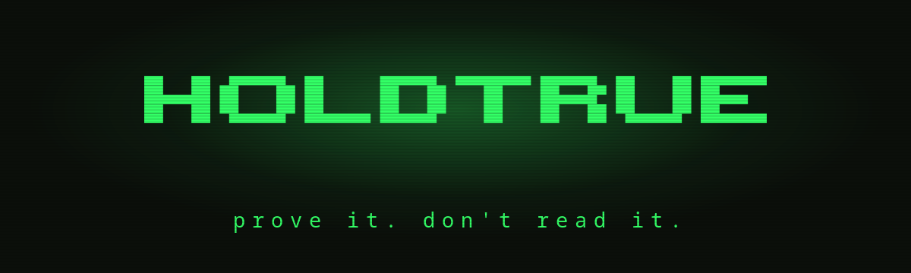
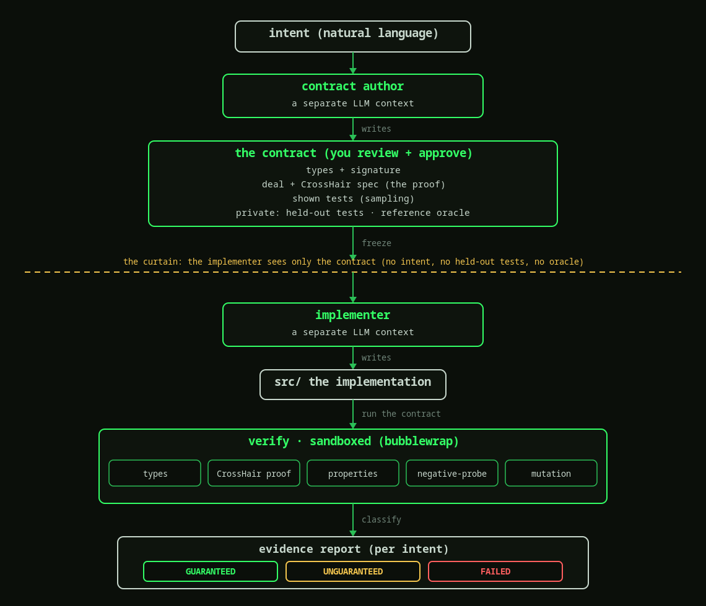

[](https://github.com/holdtrue-dev/holdtrue/actions/workflows/ci.yml)


**prove it. don't read it.**

AI writes the code. You approve a contract, and holdtrue proves the code keeps it. You review the contract, not the code.

Site: https://holdtrue-dev.github.io

## how it works

One intent, end to end:

1. **intent** (you): what the code should do, in plain language.
2. **contract author** (ai, context A): drafts a machine-checkable contract from your intent.
3. **the contract** (you): you read it and approve. this, not the code.
4. **the curtain**: the implementer sees only the contract, not your intent, not the held-out tests, not the reference oracle.
5. **implementer** (ai, context B): writes the code from the contract alone.
6. **verify** (holdtrue, sandboxed): types, proof, properties, negative-probe, mutation.
7. **the verdict** (you): with its evidence.



The two AI contexts run on an assistant you choose: a coding-agent CLI (`claude`, `aider`, `gemini`, `codex`), a chat API (Anthropic, OpenAI, Ollama), or your own command via `HOLDTRUE_AGENT_CMD`. `holdtrue providers` lists what is usable; `--provider` picks one. Any assistant, any model: the proof is the same.

## the verdict

holdtrue reports, per intent, one of:

- `GUARANTEED`: proven over all inputs, against a contract strong enough to catch injected bugs and reject broken stand-ins.
- `ENFORCED`: not proven, but the contract is checked at runtime on every call and holds over every sample. This is the honest tier for shapes CrossHair cannot exhaust (strings, lists, floats, loops): a violating input raises instead of passing silently.
- `UNGUARANTEED`: only sampled evidence. Still needs human review.
- `FAILED`: a counterexample, with the input that breaks it.

## try it

Verify a correct implementation against its contract:

```
uv run python -m holdtrue.cli verify examples/clamp --impl examples/clamp/controls/correct.py
```

Swap in `controls/buggy.py` for a `FAILED`, point at `examples/repeat` for an `ENFORCED` (a string function CrossHair cannot prove but the contract still enforces), or add `--manifest contract/manifest_weak.yaml` to watch a correct function get refused a guarantee because the contract itself is too weak.

Watch a verification stream live in a TUI:

```
uv run python -m holdtrue.cli tui examples/clamp --impl examples/clamp/controls/correct.py
```

Drive the whole loop in a TUI: pick a provider and model, type an intent, approve the contract, watch it run to a verdict:

```
uv run python -m holdtrue.cli studio
```

Or run the loop from the command line (author, self-check, approve, implement, verify):

```
uv run python -m holdtrue.cli run examples/clamp --yes
```

## never-silent revision

When verification shows the contract was wrong, holdtrue does not go silent. A self-check failure proposes a fix back to you; a second author cross-checks for an axis the contract misses (`holdtrue cross-check`); a run that cannot pass is diagnosed. A ratchet forbids weakening a check to pass, every change waits for your approval, and each one is recorded in `<project>/revisions/`.

## powered by

deal (contracts) · CrossHair (proof) · cosmic-ray (mutation) · mypy (types) · bubblewrap (sandbox)
